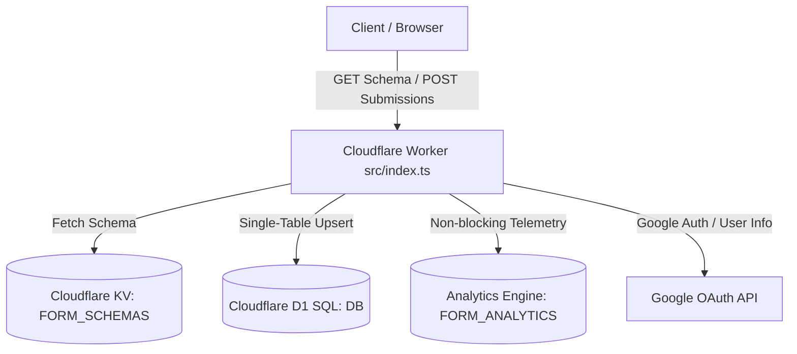
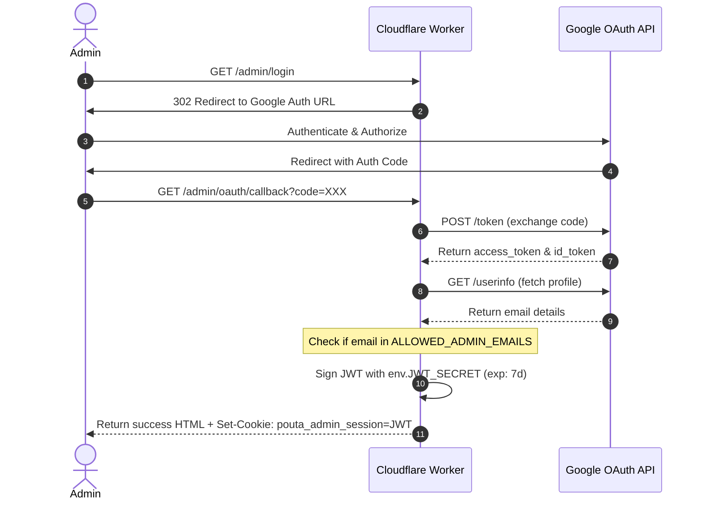
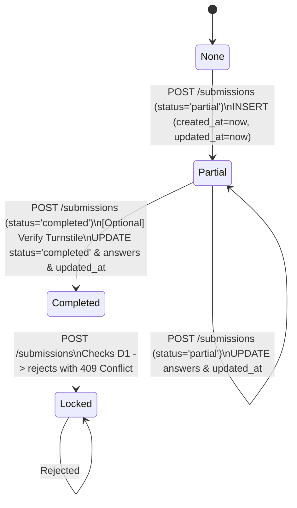

# Architecture Reference: Pouta Forms

This document provides a technical deep-dive into the architectural design of Pouta Forms.

---

## 1. System Overview

The engine runs as a lightweight, zero-dependency Cloudflare Worker positioned globally on the Cloudflare Edge. It integrates with three serverless storage engines:
- **Cloudflare KV (`FORM_SCHEMAS`)**: Key-Value store holding JSON schemas of forms, optimizing read speed for public GET requests.
- **Cloudflare D1 (`DB`)**: Serverless SQLite engine storing submission states.
- **Workers Analytics Engine (`FORM_ANALYTICS`)**: A high-volume, low-cost telemetry pipeline for tracking views and engagement events.



---

## 2. Admin Authentication Flow (Google OAuth)

Admin access relies on Google OAuth 2.0. Successful authentication results in a cryptographically signed JWT stored in a secure, HTTP-only cookie (`pouta_admin_session`).



---

## 3. Submission Lifecycle

To minimize worker compute overhead and avoid splitting transactional data, partial progress checkpoints and finalized submissions occupy the same D1 SQL table (`submissions`).

### Single-Table Upsert State Machine



### The Upsert Query
To implement the state machine efficiently, a single query handles both insertion and updates. The query updates the fields on conflict while leaving `created_at` intact:

```sql
INSERT INTO submissions (id, form_id, status, answers, created_at, updated_at)
VALUES (?1, ?2, ?3, ?4, ?5, ?5)
ON CONFLICT(id) DO UPDATE SET
  status = excluded.status,
  answers = excluded.answers,
  updated_at = excluded.updated_at
```

---

## 4. Telemetry Pipeline

High-volume events (`viewed` and `started`) bypass the transactional SQL database. Telemetry is dispatched via **Cloudflare Workers Analytics Engine** using a non-blocking, fire-and-forget method:

- **Form Views (`viewed`)**: Captured on `GET /forms/:formId`.
- **First Engagement (`started`)**: Captured when a `'partial'` submission is first inserted into the database.

### Telemetry Payload Schema
- **Index**: `form_id` (used for indexing/querying datasets).
- **Blobs**:
  1. `event_type` (`'viewed'` | `'started'`)
  2. `session_id` (unique submission ID)
  3. `country` (derived from Cloudflare request geolocation metadata)
  4. `user_agent` (HTTP User-Agent header)
  5. `referrer` (HTTP Referer header)
- **Doubles**:
  1. `timestamp` (epoch milliseconds)

---

## 5. Security & Verification

1. **JWT Cryptography**: Signed using HMAC-SHA256 via the Web Cryptography API (`crypto.subtle`), ensuring tamper-proof sessions.
2. **Turnstile Hook**: If `TURNSTILE_SECRET_KEY` is bound, submissions marked as `'completed'` must pass Turnstile anti-spam site validation via a POST call to `https://challenges.cloudflare.com/turnstile/v0/siteverify`.
3. **Compound Index**: The database compound index on `(form_id, status)` ensures that as abandoned partial submissions grow, query speeds for completed submissions remain unaffected.
